# Command contract diagram

Modified: 2026-11-21

Generated by `ruleset/scripts/contract_diagram.py` from `backend/contract/`; do not edit by hand.
Run `python ruleset/scripts/contract_diagram.py --write` after a contract change, and
`test_contract_diagram.py` fails until the page matches. What the contract is:
[README.md](README.md#commands) and [contract.md](../core/contract.md).

31 commands. Each is a class diagram of its input and its result; a field whose type is
a shared type of `common.json` links to it, and the shared types are drawn once, below.

## Shared types

The object types of `common.json`, and the shared types their fields name.

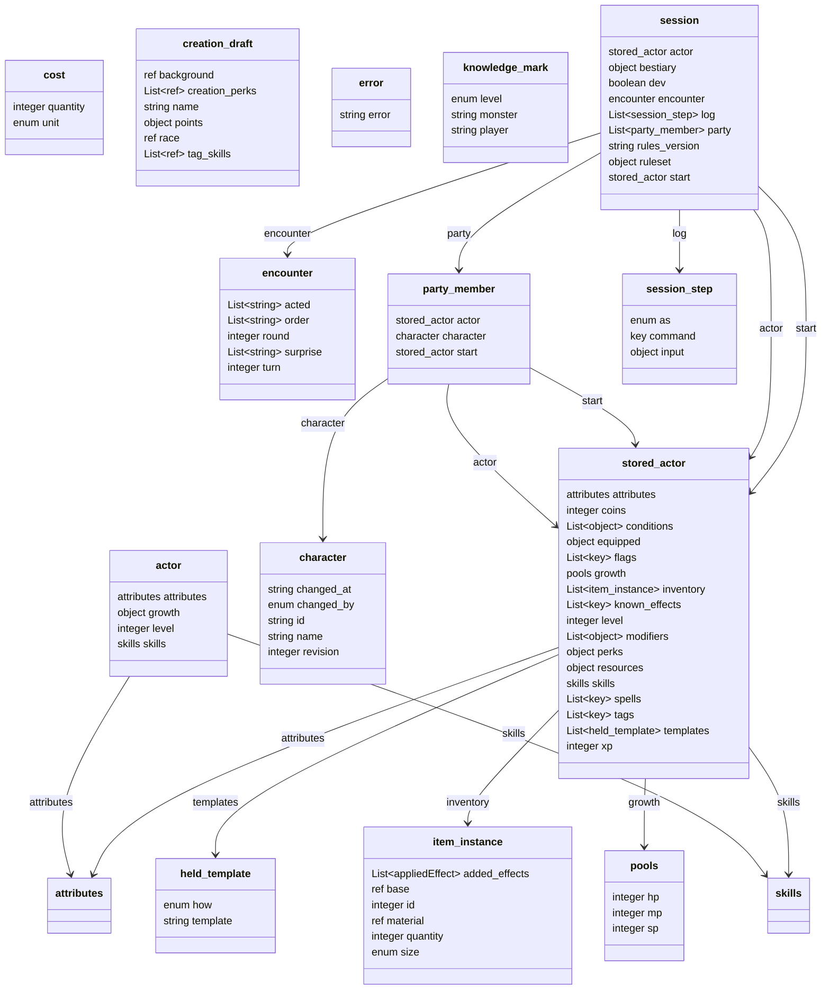
```mermaid
classDiagram
    class actor {
        attributes attributes
        object growth
        integer level
        skills skills
    }
    class attributes {
    }
    class character {
        string changed_at
        enum changed_by
        string id
        string name
        integer revision
    }
    class cost {
        integer quantity
        enum unit
    }
    class creation_draft {
        ref background
        List~ref~ creation_perks
        string name
        object points
        ref race
        List~ref~ tag_skills
    }
    class encounter {
        List~string~ acted
        List~string~ order
        integer round
        List~string~ surprise
        integer turn
    }
    class error {
        string error
    }
    class held_template {
        enum how
        string template
    }
    class item_instance {
        List~appliedEffect~ added_effects
        ref base
        integer id
        ref material
        integer quantity
        enum size
    }
    class knowledge_mark {
        enum level
        string monster
        string player
    }
    class party_member {
        stored_actor actor
        character character
        stored_actor start
    }
    class pools {
        integer hp
        integer mp
        integer sp
    }
    class session {
        stored_actor actor
        object bestiary
        boolean dev
        encounter encounter
        List~session_step~ log
        List~party_member~ party
        string rules_version
        object ruleset
        stored_actor start
    }
    class session_step {
        enum as
        key command
        object input
    }
    class skills {
    }
    class stored_actor {
        attributes attributes
        integer coins
        List~object~ conditions
        object equipped
        List~key~ flags
        pools growth
        List~item_instance~ inventory
        List~key~ known_effects
        integer level
        List~object~ modifiers
        object perks
        object resources
        skills skills
        List~key~ spells
        List~key~ tags
        List~held_template~ templates
        integer xp
    }
    actor --> attributes : attributes
    actor --> skills : skills
    party_member --> character : character
    party_member --> stored_actor : actor
    party_member --> stored_actor : start
    session --> encounter : encounter
    session --> party_member : party
    session --> session_step : log
    session --> stored_actor : actor
    session --> stored_actor : start
    stored_actor --> attributes : attributes
    stored_actor --> held_template : templates
    stored_actor --> item_instance : inventory
    stored_actor --> pools : growth
    stored_actor --> skills : skills
```

## Session steps

What each session step reads from the stored actor and writes back, from the table in
[sessions.md](sessions.md#what-a-step-reads-and-writes).

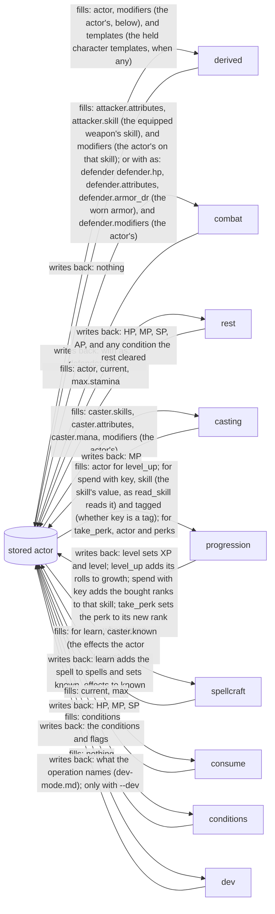
```mermaid
flowchart LR
    actor[("stored actor")]
    derived["derived"]
    actor -- "fills: actor, modifiers (the actor's, below), and templates (the held character templates, when any)" --> derived
    derived -- "writes back: nothing" --> actor
    combat["combat"]
    actor -- "fills: attacker.attributes, attacker.skill (the equipped weapon's skill), and modifiers (the actor's on that skill); or with as: defender defender.hp, defender.attributes, defender.armor_dr (the worn armor), and defender.modifiers (the actor's)" --> combat
    combat -- "writes back: with as: defender, HP" --> actor
    rest["rest"]
    actor -- "fills: actor, current, max.stamina" --> rest
    rest -- "writes back: HP, MP, SP, AP, and any condition the rest cleared" --> actor
    casting["casting"]
    actor -- "fills: caster.skills, caster.attributes, caster.mana, modifiers (the actor's)" --> casting
    casting -- "writes back: MP" --> actor
    progression["progression"]
    actor -- "fills: actor for level_up; for spend with key, skill (the skill's value, as read_skill reads it) and tagged (whether key is a tag); for take_perk, actor and perks" --> progression
    progression -- "writes back: level sets XP and level; level_up adds its rolls to growth; spend with key adds the bought ranks to that skill; take_perk sets the perk to its new rank when taken" --> actor
    spellcraft["spellcraft"]
    actor -- "fills: for learn, caster.known (the effects the actor knows)" --> spellcraft
    spellcraft -- "writes back: learn adds the spell to spells and sets known_effects to known" --> actor
    consume["consume"]
    actor -- "fills: current, max" --> consume
    consume -- "writes back: HP, MP, SP" --> actor
    conditions["conditions"]
    actor -- "fills: conditions" --> conditions
    conditions -- "writes back: the conditions and flags" --> actor
    dev["dev"]
    actor -- "fills: nothing" --> dev
    dev -- "writes back: what the operation names (dev-mode.md); only with --dev" --> actor
```

## actions

The AP pool and the cost of a list of actions, in AP and in real-time stamina.

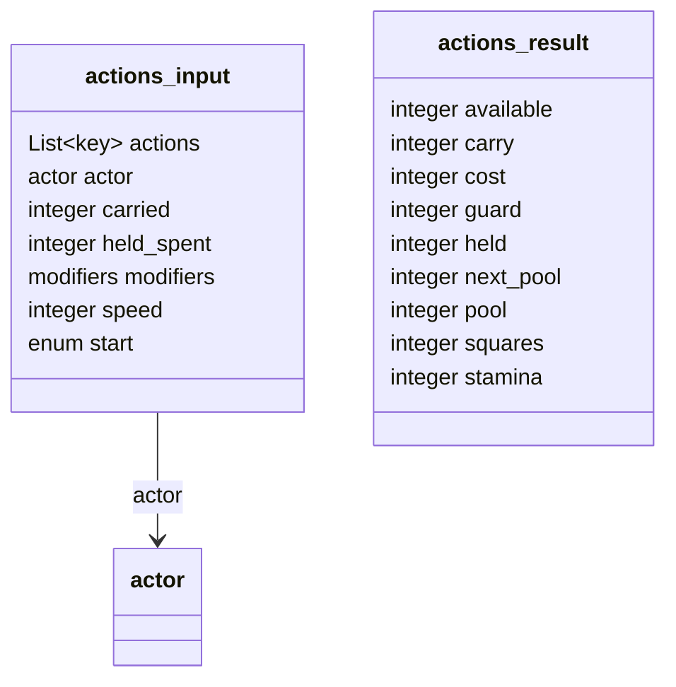
```mermaid
classDiagram
    class actions_input {
        List~key~ actions
        actor actor
        integer carried
        integer held_spent
        modifiers modifiers
        integer speed
        enum start
    }
    class actions_result {
        integer available
        integer carry
        integer cost
        integer guard
        integer held
        integer next_pool
        integer pool
        integer squares
        integer stamina
    }
    class actor
    actions_input --> actor : actor
```

## ammunition

Recover the rounds fired in a fight.

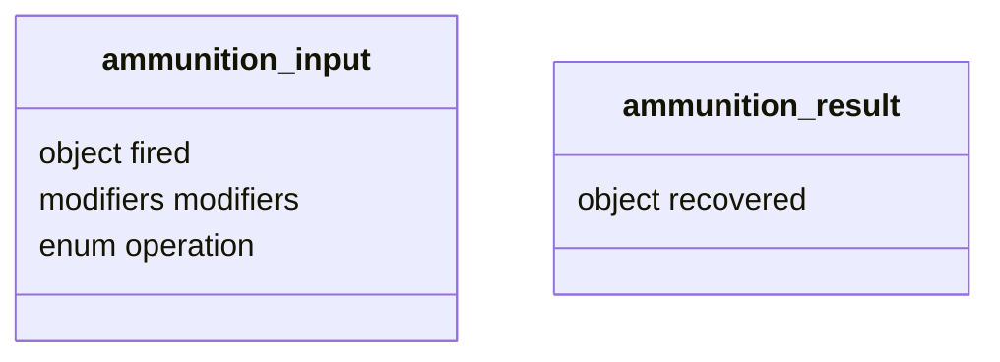
```mermaid
classDiagram
    class ammunition_input {
        object fired
        modifiers modifiers
        enum operation
    }
    class ammunition_result {
        object recovered
    }
```

## attack_sequence

One attack action by loadout: the attack, the jab, the full attack, or the circle cut, each strike its own roll through the combat pipeline.

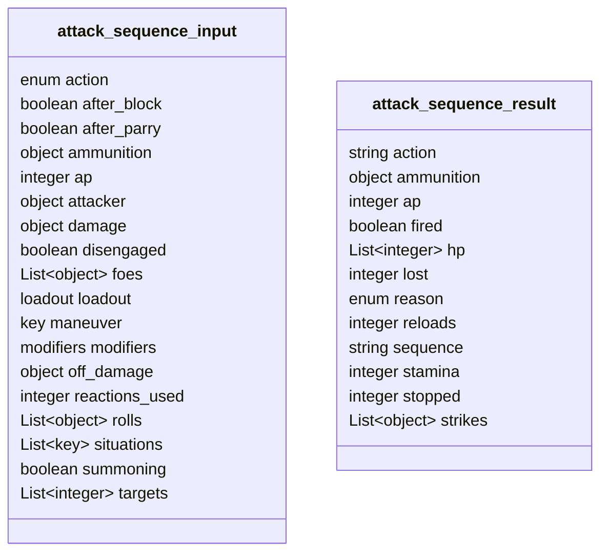
```mermaid
classDiagram
    class attack_sequence_input {
        enum action
        boolean after_block
        boolean after_parry
        object ammunition
        integer ap
        object attacker
        object damage
        boolean disengaged
        List~object~ foes
        loadout loadout
        key maneuver
        modifiers modifiers
        object off_damage
        integer reactions_used
        List~object~ rolls
        List~key~ situations
        boolean summoning
        List~integer~ targets
    }
    class attack_sequence_result {
        string action
        object ammunition
        integer ap
        boolean fired
        List~integer~ hp
        integer lost
        enum reason
        integer reloads
        string sequence
        integer stamina
        integer stopped
        List~object~ strikes
    }
```

## author

Author content rows: check a draft spell as validate.py would, give the spellcraft cost, load a spell to edit, list the effects a color may use, and export a core or module data file.

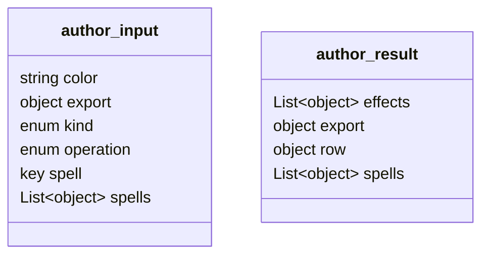
```mermaid
classDiagram
    class author_input {
        string color
        object export
        enum kind
        enum operation
        key spell
        List~object~ spells
    }
    class author_result {
        List~object~ effects
        object export
        object row
        List~object~ spells
    }
```

## bestiary

Mark what the players know of each monster, and show the bestiary as the GM or a player sees it.

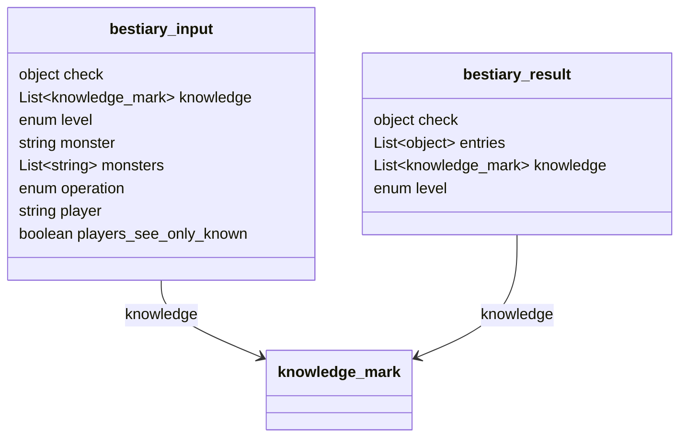
```mermaid
classDiagram
    class bestiary_input {
        object check
        List~knowledge_mark~ knowledge
        enum level
        string monster
        List~string~ monsters
        enum operation
        string player
        boolean players_see_only_known
    }
    class bestiary_result {
        object check
        List~object~ entries
        List~knowledge_mark~ knowledge
        enum level
    }
    class knowledge_mark
    bestiary_input --> knowledge_mark : knowledge
    bestiary_result --> knowledge_mark : knowledge
```

## casting

Cast one spell: the gate, the mana and reagent cost, one resolution on the spell's color skill with the armor penalty, then the effects, concentration, and dispel.

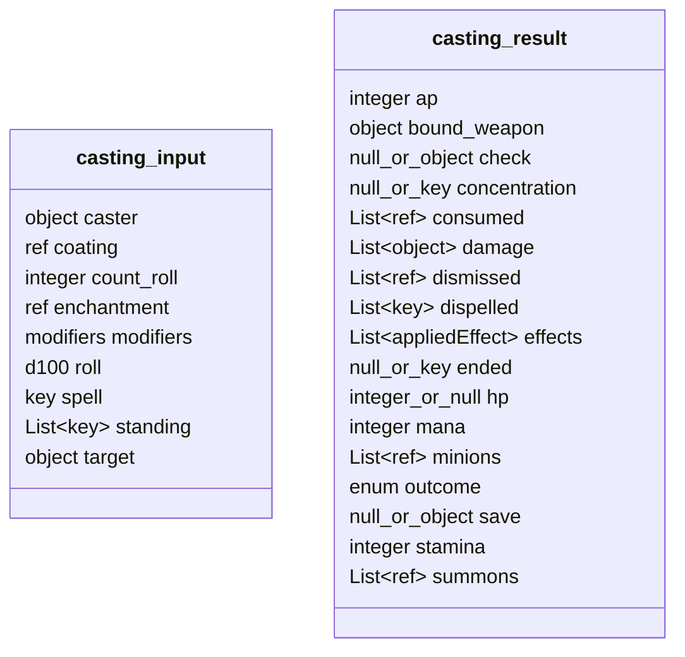
```mermaid
classDiagram
    class casting_input {
        object caster
        ref coating
        integer count_roll
        ref enchantment
        modifiers modifiers
        d100 roll
        key spell
        List~key~ standing
        object target
    }
    class casting_result {
        integer ap
        object bound_weapon
        null_or_object check
        null_or_key concentration
        List~ref~ consumed
        List~object~ damage
        List~ref~ dismissed
        List~key~ dispelled
        List~appliedEffect~ effects
        null_or_key ended
        integer_or_null hp
        integer mana
        List~ref~ minions
        enum outcome
        null_or_object save
        integer stamina
        List~ref~ summons
    }
```

## catalog

Every table a player or a GM studies to plan a build, from core and the loaded modules, each row resolved through its base: list the collections, list one filtered and sorted, or get one row.

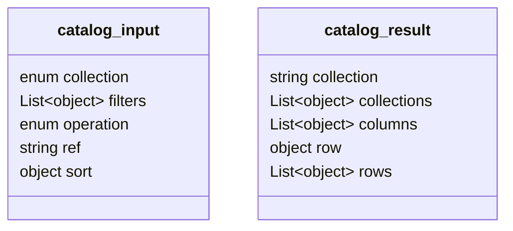
```mermaid
classDiagram
    class catalog_input {
        enum collection
        List~object~ filters
        enum operation
        string ref
        object sort
    }
    class catalog_result {
        string collection
        List~object~ collections
        List~object~ columns
        object row
        List~object~ rows
    }
```

## combat

One attack from the roll to the HP lost: one attack roll read against the defender's evasion and block bands.

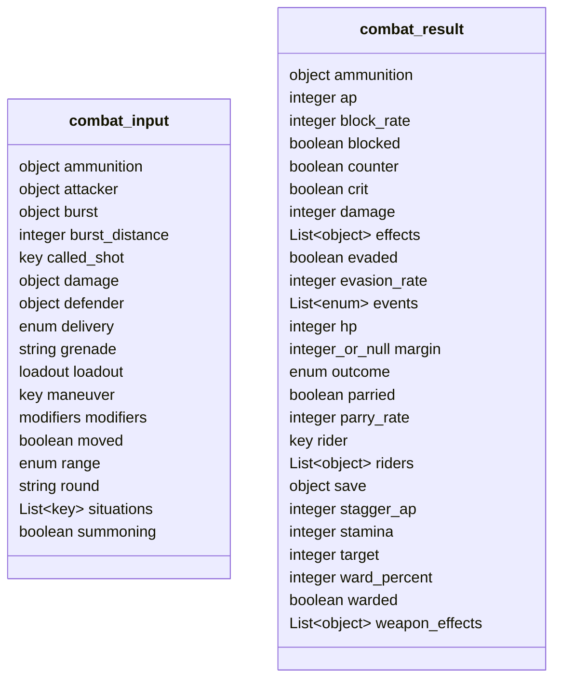
```mermaid
classDiagram
    class combat_input {
        object ammunition
        object attacker
        object burst
        integer burst_distance
        key called_shot
        object damage
        object defender
        enum delivery
        string grenade
        loadout loadout
        key maneuver
        modifiers modifiers
        boolean moved
        enum range
        string round
        List~key~ situations
        boolean summoning
    }
    class combat_result {
        object ammunition
        integer ap
        integer block_rate
        boolean blocked
        boolean counter
        boolean crit
        integer damage
        List~object~ effects
        boolean evaded
        integer evasion_rate
        List~enum~ events
        integer hp
        integer_or_null margin
        enum outcome
        boolean parried
        integer parry_rate
        key rider
        List~object~ riders
        object save
        integer stagger_ap
        integer stamina
        integer target
        integer ward_percent
        boolean warded
        List~object~ weapon_effects
    }
```

## command_summons

What each of a commander's summons gets: an order (the command action) gives the summons it reaches AP for their next turn, and a held command spell gives every summon a bonus to attack while it is held.

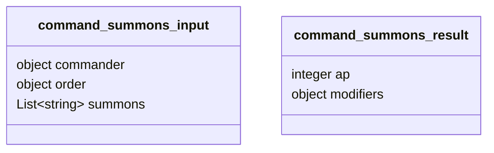
```mermaid
classDiagram
    class command_summons_input {
        object commander
        object order
        List~string~ summons
    }
    class command_summons_result {
        integer ap
        object modifiers
    }
```

## conditions

Apply and remove conditions by effect events, then read values and flags.

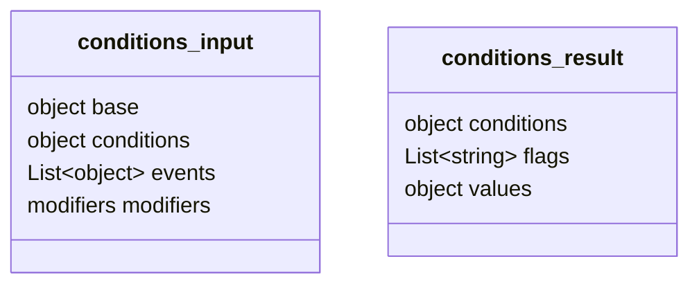
```mermaid
classDiagram
    class conditions_input {
        object base
        object conditions
        List~object~ events
        modifiers modifiers
    }
    class conditions_result {
        object conditions
        List~string~ flags
        object values
    }
```

## consume

Use items and let time pass: instant and over-time effects, and food replacing food.

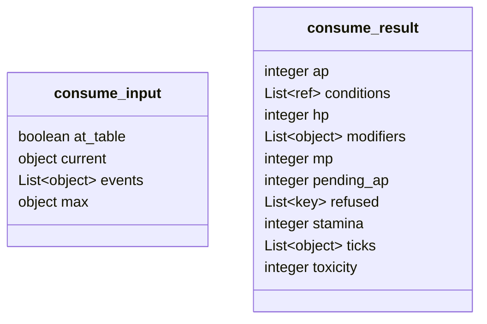
```mermaid
classDiagram
    class consume_input {
        boolean at_table
        object current
        List~object~ events
        object max
    }
    class consume_result {
        integer ap
        List~ref~ conditions
        integer hp
        List~object~ modifiers
        integer mp
        integer pending_ap
        List~key~ refused
        integer stamina
        List~object~ ticks
        integer toxicity
    }
```

## creation

Character creation: the rules a form is drawn from, a check of a draft step by step, and the stored actor a complete draft becomes.

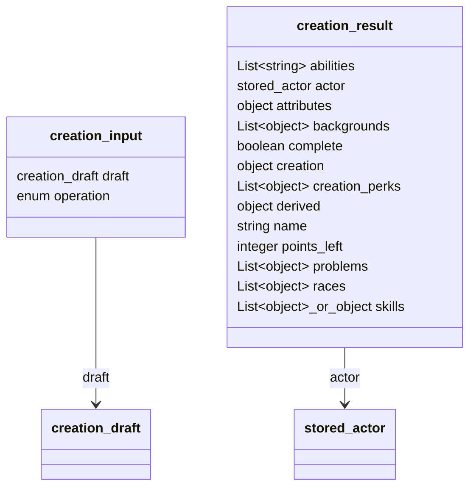
```mermaid
classDiagram
    class creation_input {
        creation_draft draft
        enum operation
    }
    class creation_result {
        List~string~ abilities
        stored_actor actor
        object attributes
        List~object~ backgrounds
        boolean complete
        object creation
        List~object~ creation_perks
        object derived
        string name
        integer points_left
        List~object~ problems
        List~object~ races
        List~object~_or_object skills
    }
    class creation_draft
    class stored_actor
    creation_input --> creation_draft : draft
    creation_result --> stored_actor : actor
```

## derived

HP, MP, SP, AP, carry, initiative, and the toxicity limit from attributes, level, and modifiers.

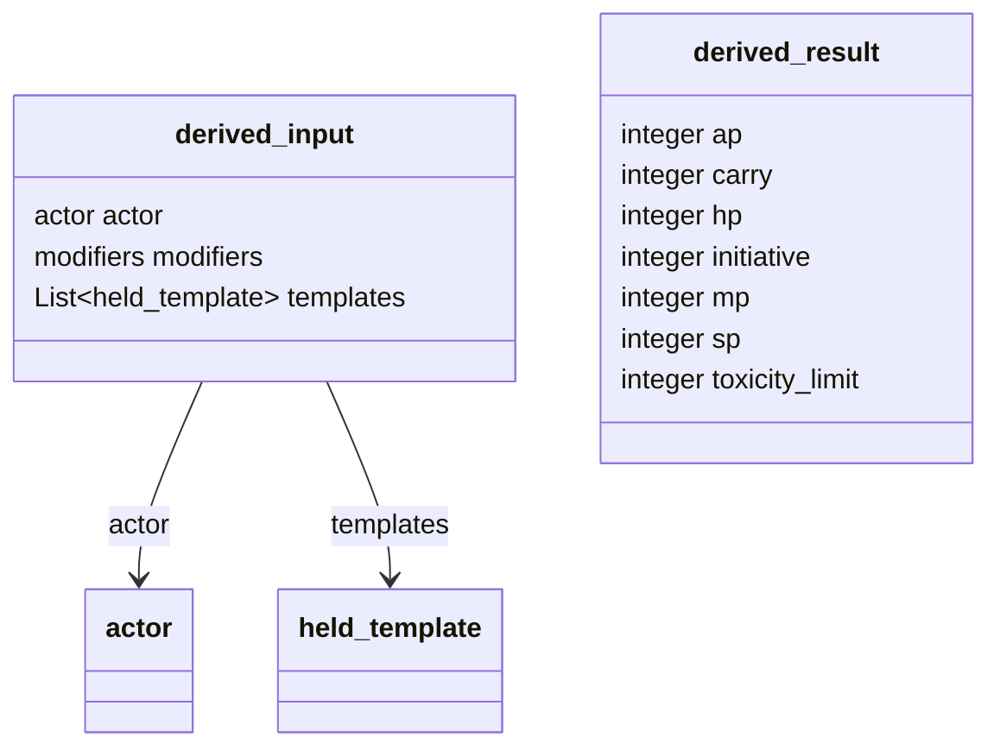
```mermaid
classDiagram
    class derived_input {
        actor actor
        modifiers modifiers
        List~held_template~ templates
    }
    class derived_result {
        integer ap
        integer carry
        integer hp
        integer initiative
        integer mp
        integer sp
        integer toxicity_limit
    }
    class actor
    class held_template
    derived_input --> actor : actor
    derived_input --> held_template : templates
```

## dev

Dev mode only (--dev): change a session's actor directly for testing, log the operation, and mark the session dev.

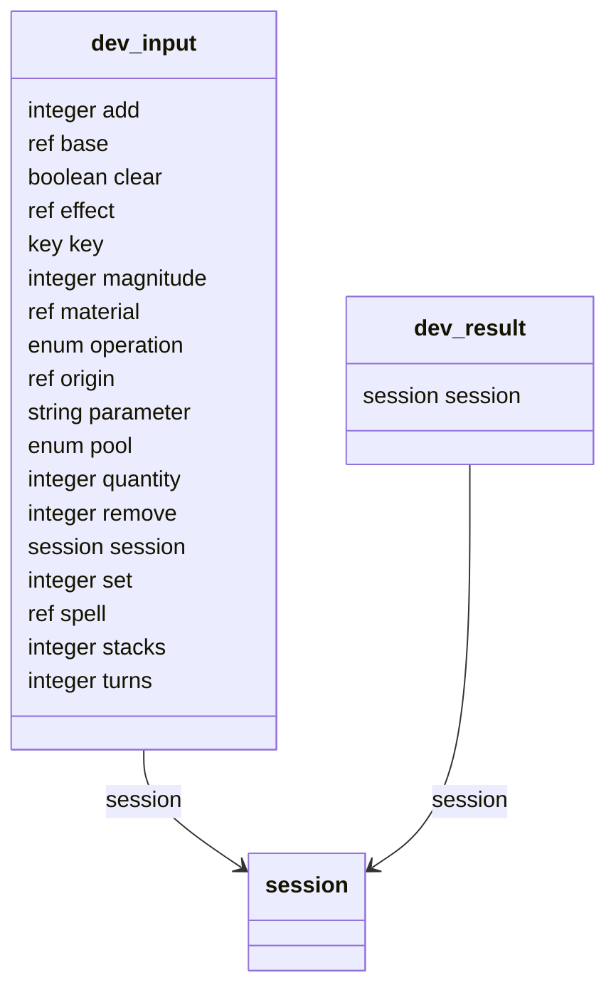
```mermaid
classDiagram
    class dev_input {
        integer add
        ref base
        boolean clear
        ref effect
        key key
        integer magnitude
        ref material
        enum operation
        ref origin
        string parameter
        enum pool
        integer quantity
        integer remove
        session session
        integer set
        ref spell
        integer stacks
        integer turns
    }
    class dev_result {
        session session
    }
    class session
    dev_input --> session : session
    dev_result --> session : session
```

## economy

Convert a cost to copper, or price a purchase or sale with an optional barter check.

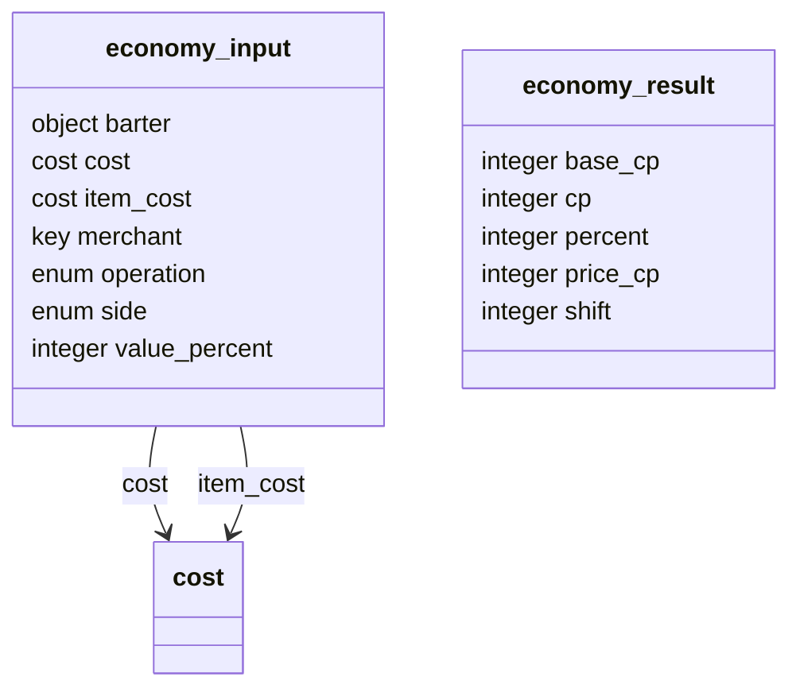
```mermaid
classDiagram
    class economy_input {
        object barter
        cost cost
        cost item_cost
        key merchant
        enum operation
        enum side
        integer value_percent
    }
    class economy_result {
        integer base_cp
        integer cp
        integer percent
        integer price_cp
        integer shift
    }
    class cost
    economy_input --> cost : cost
    economy_input --> cost : item_cost
```

## encounter

Run a fight offline: the initiative order, whose turn it is, and the round.

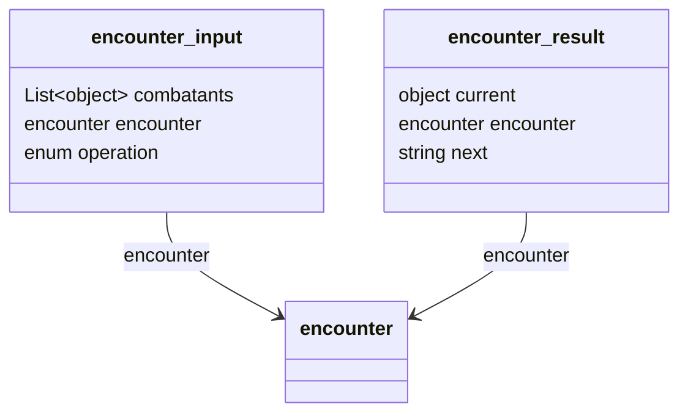
```mermaid
classDiagram
    class encounter_input {
        List~object~ combatants
        encounter encounter
        enum operation
    }
    class encounter_result {
        object current
        encounter encounter
        string next
    }
    class encounter
    encounter_input --> encounter : encounter
    encounter_result --> encounter : encounter
```

## formula

Evaluate a formula tree, by key or inline.

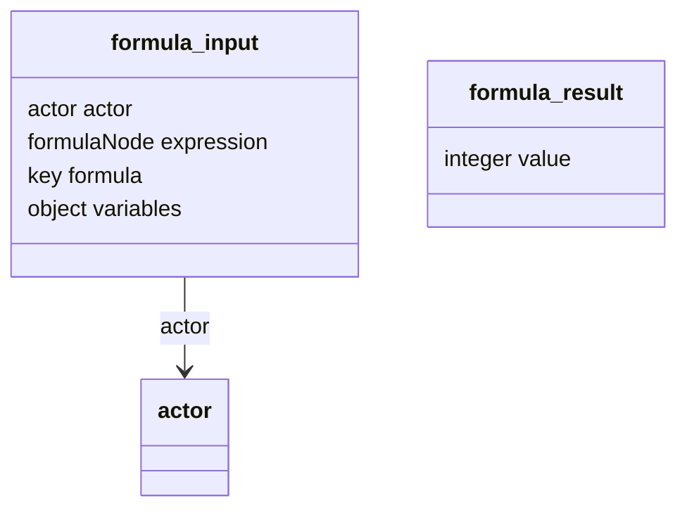
```mermaid
classDiagram
    class formula_input {
        actor actor
        formulaNode expression
        key formula
        object variables
    }
    class formula_result {
        integer value
    }
    class actor
    formula_input --> actor : actor
```

## hazard

Detect, disarm, or trigger a hazard, or apply a cast spell to it: the checks go through the resolution function; a trigger emits a packet and effects; a spell may disarm it.

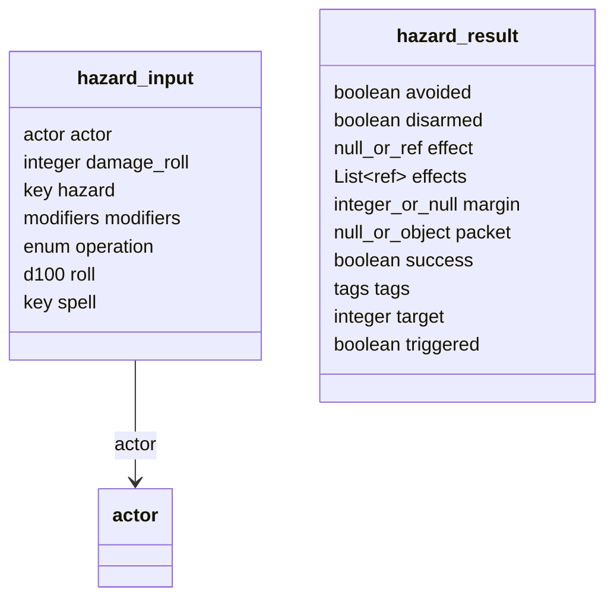
```mermaid
classDiagram
    class hazard_input {
        actor actor
        integer damage_roll
        key hazard
        modifiers modifiers
        enum operation
        d100 roll
        key spell
    }
    class hazard_result {
        boolean avoided
        boolean disarmed
        null_or_ref effect
        List~ref~ effects
        integer_or_null margin
        null_or_object packet
        boolean success
        tags tags
        integer target
        boolean triggered
    }
    class actor
    hazard_input --> actor : actor
```

## loot

Roll a loot table by key, or a monster's loot rows, with the looter's Luck and modifiers, and value it on the price scale.

```mermaid
classDiagram
    class loot_input {
        actor actor
        modifiers modifiers
        ref monster
        List~integer~ rolls
        key table
    }
    class loot_result {
        integer budget_cp
        integer coins_cp
        List~object~ items
        integer looter_shift
        key table
        List~key~ tables
        integer value_cp
    }
    class actor
    loot_input --> actor : actor
```

## modifiers

Apply modifiers to one value; report granted flags and a packet after resist.

```mermaid
classDiagram
    class modifiers_input {
        integer elapsed_turns
        modifiers modifiers
        object packet
        List~string~ removed_sources
        boolean summoning
        string target
        integer value
    }
    class modifiers_result {
        List~string~ flags
        integer packet
        integer value
    }
```

## monster_sheet

A monster's derived stats and the skills asked for, by the same rules as a player.

```mermaid
classDiagram
    class monster_sheet_input {
        object monster
        List~key~ read_skills
    }
    class monster_sheet_result {
        integer ap
        integer carry
        integer hp
        integer initiative
        List~ref~ maneuvers
        integer mp
        List~ref~ riders
        object skills
        integer sp
    }
```

## overwatch

Hold a shot or a zone under fire until the shooter's next turn, and say which foes draw a strike.

```mermaid
classDiagram
    class overwatch_input {
        integer ap
        List~object~ events
        loadout loadout
        key maneuver
        integer rounds
        object shooter
    }
    class overwatch_result {
        integer ap
        integer ap_returned
        integer rounds
        integer rounds_left
        List~object~ shots
        List~object~ zone_attacks
    }
```

## print

A printable page from the data: a character sheet, a spell card, a monster stat block, or a condition card.

```mermaid
classDiagram
    class print_input {
        stored_actor actor
        key condition
        enum kind
        string label
        object monster
        key spell
        enum state
    }
    class print_result {
        string html
        string title
    }
    class stored_actor
    print_input --> stored_actor : actor
```

## progression

XP and level, a level-up pool, spending points on a skill or a skill group, reading a skill off a sheet, taking a perk, and checking a creation point-buy.

```mermaid
classDiagram
    class progression_input {
        actor actor
        string group
        object groups
        integer hp_roll
        key key
        integer level
        integer luck_roll
        integer mp_roll
        enum operation
        key perk
        object perks
        integer points
        string read
        integer skill
        integer sp_roll
        boolean tagged
        integer xp
    }
    class progression_result {
        object gain
        integer left
        integer level
        string perk
        integer perks
        integer rank
        integer ranks
        enum read_from
        integer skill_points
        integer spent
        boolean taken
        List~object~ unmet
        integer value
        integer_or_null xp_step
        integer xp_total
    }
    class actor
    progression_input --> actor : actor
```

## resolution

One d100 check: target, success, margin, and crit and fumble tags.

```mermaid
classDiagram
    class resolution_input {
        actor actor
        modifiers modifiers
        d100 roll
        key skill
    }
    class resolution_result {
        integer_or_null margin
        boolean success
        tags tags
        integer target
    }
    class actor
    resolution_input --> actor : actor
```

## rest

Recover resources and clear conditions for one rest occasion.

```mermaid
classDiagram
    class rest_input {
        actor actor
        List~object~ conditions
        object current
        object max
        key meal
        modifiers modifiers
        key occasion
        object running
    }
    class rest_result {
        integer ap
        List~key~ conditions
        integer hp
        integer mp
        List~key~ refused
        object running
        integer stamina
        integer toxicity
    }
    class actor
    rest_input --> actor : actor
```

## session

Start, advance, or replay a run: a stored actor and a log of commands.

```mermaid
classDiagram
    class session_input {
        enum operation
        session session
        stored_actor start
        session_step step
    }
    class session_result {
        boolean matches
        object result
        session session
    }
    class session
    class session_step
    class stored_actor
    session_input --> session : session
    session_input --> session_step : step
    session_input --> stored_actor : start
    session_result --> session : session
```

## share

What one ally gets from the bards and skalds near it: each sharer within its perk's range lends its CHA modifier to the perk's group as a morale modifier for some turns; the strongest counts per attribute.

```mermaid
classDiagram
    class share_input {
        integer elapsed_turns
        List~object~ sharers
    }
    class share_result {
        object bonus
        modifiers modifiers
    }
```

## spellcraft

Spell knowledge: check a crafted spell against the effects the caster knows, learn a spell's craftable effects, or research one effect.

```mermaid
classDiagram
    class spellcraft_input {
        object caster
        enum color
        ref effect
        modifiers modifiers
        enum operation
        d100 roll
        key_or_object spell
    }
    class spellcraft_result {
        integer_or_null cast_threshold
        null_or_object check
        null_or_cost cost
        integer_or_null craft_threshold
        integer days
        List~ref~ known
        integer_or_null mana
        enum outcome
        null_or_enum reason
        List~object~ rejected
        boolean skill_ok
        List~ref~ taught
        boolean valid
    }
    class cost
    spellcraft_result --> cost : cost
```

## stance

A fighting stance over a stretch of turns: take or change one, end it, or change the loadout, which ends a stance it no longer fits.

```mermaid
classDiagram
    class stance_input {
        List~object~ events
        loadout loadout
        List~featureRef~ perks
        string_or_null stance
    }
    class stance_result {
        integer ap
        modifiers modifiers
        string_or_null stance
        List~object~ steps
    }
```

## stored_actor

Check a stored actor and return it unchanged, so a save round-trips; or make a new one from attributes, with its pools full.

```mermaid
classDiagram
    class stored_actor_input {
        stored_actor actor
        object new
    }
    class stored_actor_result {
        stored_actor actor
    }
    class stored_actor
    stored_actor_input --> stored_actor : actor
    stored_actor_result --> stored_actor : actor
```

## wuxing

The cycle that fires when two phased participants meet.

```mermaid
classDiagram
    class wuxing_input {
        number actor_magnitude
        phase_or_null actor_phase
        number recipient_magnitude
        phase_or_null recipient_phase
    }
    class wuxing_result {
        enum affects
        string cycle
        string interaction
        number multiplier
    }
```
